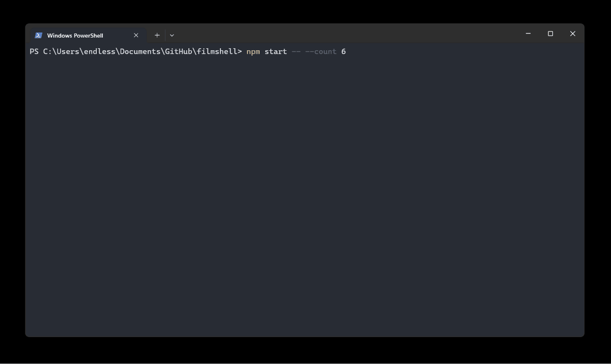

<p align="center">
  
</p>

<h1 align="center">FilmShell</h1>
<p align="center">🎥 CLI to help you analyze Halo Infinite film files</p>

> [!WARNING]
> This is **not** an official Microsoft or Halo Studios product. FilmShell relies on undocumented APIs that may change or be restricted at any time. Use at your own risk. So far there have been no negative consequences from using these APIs, but Microsoft or Halo Studios may choose to change that stance at any point, which could result in account restrictions or bans.

> [!NOTE]
> This project is experimental and exploratory. The film binary format is not publicly documented and motion extraction relies on reverse-engineered heuristics. Many films may not produce correct paths yet as work continues on more universal parsing.

FilmShell connects to the Halo Infinite API, downloads theater film data, and turns it into something you can actually see. It pulls per-player movement out of the raw binary chunks, grabs map metadata (MVAR) for object placements, and renders SVG visualizations of player paths overlaid on the map geometry. For background on the early exploration that led to this project, see [Extracting Stats From Film Files in Halo Infinite](https://den.dev/blog/extracting-stats-film-files-halo-infinite/).

<p align="center">
  
</p>

## Table of contents

- [Prerequisites](#prerequisites)
- [Creating the Entra application](#creating-the-entra-application)
- [Setup](#setup)
- [Usage](#usage)
- [Output](#output)
- [Object IDs](#object-ids)
- [Reference films](#reference-films)
- [How it works](#how-it-works)
- [Binary viewer](#binary-viewer)
- [License](#license)
- [Acknowledgements](#acknowledgements)

## Prerequisites

- [Node.js](https://nodejs.org/) 18 or later
- A Microsoft Entra application registered for Xbox Live authentication ([see below](#creating-the-entra-application))

## Creating the Entra application

FilmShell authenticates through Xbox Live using a personal Microsoft account. You need to register an application in the Azure portal to get a client ID.

1. Go to the [Azure portal](https://portal.azure.com/) and navigate to **Microsoft Entra ID** > **App registrations** > **New registration**.
2. Give the application a name (e.g., "FilmShell").
3. Under **Supported account types**, select **Personal Microsoft accounts only**.
4. Under **Redirect URI**, select the **Mobile and desktop applications** platform and enter `http://localhost/callback`.
5. Click **Register**. Copy the **Application (client) ID** from the overview page - this is your client ID.

> [!NOTE]
> A [public client application](https://learn.microsoft.com/entra/identity-platform/msal-client-applications) is sufficient. You do not need to create a client secret.

No additional API permissions need to be configured. The Xbox Live scopes (`Xboxlive.signin` and `Xboxlive.offline_access`) are requested automatically at runtime.

## Setup

1. Clone the repository and install dependencies:

   ```sh
   git clone https://github.com/dend/filmshell.git
   cd filmshell
   npm install
   ```

2. Copy the example config and add your client ID:

   ```sh
   cp config.example.json config.json
   ```

   Edit `config.json` and replace `YOUR_ENTRA_CLIENT_ID_HERE` with the Application (client) ID from [the step above](#creating-the-entra-application).

3. Build the project:

   ```sh
   npm run build
   ```

> [!WARNING]
> `tokens.bin` is encrypted at rest using a key derived from your machine's hostname and OS username. This is **not** a substitute for proper secret management - anyone with access to the same machine account can derive the same key. If your hostname or username changes, the existing tokens cannot be decrypted and you will need to re-authenticate.

## Usage

### Download and process your latest match

```sh
npm start
```

This will:

1. Open a browser-based Microsoft sign-in flow
2. Fetch your most recent match from the Halo Infinite API
3. Download and decompress the film chunks
4. Fetch the map's MVAR asset and extract object placements (spawn points, weapons, equipment)
5. Extract player movement from the film binary data
6. Generate an SVG visualization in the film's output directory

### Process multiple recent matches

```sh
npm start -- --count 5
```

### Re-process an already-downloaded film

If you've previously downloaded a film, you can re-process it without authenticating:

```sh
npm start -- --match-id <match-guid>
```

The match GUID corresponds to a directory under `films/`.

### Development mode

Build and run in one step:

```sh
npm run dev
```

## Output

Each processed match creates a directory under `films/<match-id>/` containing:

| File | Description |
|---|---|
| `match-metadata.json` | Match stats from the Halo API |
| `film-metadata.json` | Film asset metadata (chunks, duration) |
| `filmChunkN_dec` | Decompressed film chunk binaries |
| `mvar.json` | Parsed map variant Bond document (if MVAR was fetched) |
| `objects.json` | Extracted map objects with world positions |
| `path.svg` | Player movement path visualization |

## Object IDs

FilmShell uses `src/objects.json` to map numeric object IDs in MVAR data to human-readable names (e.g., spawn points, weapons, flags). The Halo Infinite binary formats don't include object names directly - only integer references.

> [!WARNING]
> The object ID list is incomplete and may require changes as new objects are discovered. Contributions to expand the list are welcome!

The most reliable way to discover new object IDs is to create custom maps in Forge with known object placements, then perform MVAR dumps of those maps to correlate the IDs with the objects you placed. This lets you build up the mapping incrementally as you encounter new object types.

## Reference films

The repository includes seven pre-downloaded films in `films/` that can be used to validate the implementation without needing API access. All matches were played on [Aquarius](https://www.halowaypoint.com/halo-infinite/ugc/maps/33c0766c-ef15-48f8-b298-34aba5bff3b4). The first six have the human player making a full loop of the map; the seventh is a solo combat test. Re-process any of them with:

```sh
npm start -- --match-id <match-guid>
```

| Match ID | Players | Type | Notes |
|---|---|---|---|
| `53a98da9-718d-4374-b739-b0ee2e7033ba` | 2 humans | PvP | Full loop |
| `a422938f-dd2e-4c9d-88a5-fab76e6c9efa` | 2 humans | PvP | Full loop |
| `4bfdd8b9-0a51-4646-a25c-4e28c2b2f8a1` | 1 human + 1 bot | PvE | Full loop |
| `b632adeb-1756-4c7b-b230-f2fd95d9b85b` | 1 human + 1 bot | PvE | Full loop |
| `152dd30f-a99b-4e51-addb-7679c566a725` | 1 human | Solo | Full loop |
| `2cf8d130-4363-48b1-b7b8-62b5a6e01454` | 1 human | Solo | Full loop |
| `b49f075b-f82b-4ad6-940b-fc31f53756bb` | 1 human | Solo | Half-circle, MA40 AR fire at south spawn, MK50 Sidekick fire at north spawn |

Each film directory contains the decompressed film chunks, match/film metadata, cached map objects, the parsed MVAR document, and the generated SVG path visualization.

> [!NOTE]
> **Films from matches with bots currently produce incorrect path output**. The root cause is under investigation.

## How it works

1. **Authentication** - OAuth flow through Microsoft Entra using [conch](https://www.npmjs.com/package/@dendotdev/conch) to obtain Xbox Live tokens, then [grunt](https://www.npmjs.com/package/@dendotdev/grunt) to exchange them for a Spartan token for the Halo Infinite API.
2. **Film download** - Uses grunt's `HaloInfiniteClient` to fetch match history, retrieve the film asset, and download/decompress zlib-compressed film chunks.
3. **Map metadata** - Fetches the map variant (MVAR) asset, parses the Bond Compact Binary v2 format, and extracts object placements (spawn points, weapons, objectives) with world coordinates.
4. **Motion extraction** - Scans film chunk binaries for frame markers (`A0 7B 42`), auto-detects the position encoding variant per player, and accumulates coordinate deltas into movement paths. Supports multiple encoding formats across different maps.
5. **SVG generation** - Scales motion data to world coordinates using map bounds, anchors paths to detected spawn positions, and renders per-player movement trails with map object overlays.

## Weapon fire events

> [!NOTE]
> Fire event decoding is not yet implemented in FilmShell. The findings below document the binary encoding for future implementation. Initial analysis and weapon ID discovery by [Andy Curtis](https://github.com/acurtis166) — see the full [discussion thread](https://github.com/dend/blog-comments/issues/5).

Weapon fire events are encoded in the film chunk bit stream at a **4-bit offset** from byte boundaries. Each fire event contains the weapon ID, weapon slot, a rolling fire counter, and an aim vector using [octahedral encoding](https://stackoverflow.com/a/74745666).

### Fire event structure

All fields are bit-packed at a 4-bit shift:

| Offset | Size | Field | Notes |
|---|---|---|---|
| 0 | 1 byte | Lead byte | `0x0d` for fire events |
| 1 | 1 byte | Player/constant | `0x26` — bit-packed with player index |
| 2 | 1 byte | Constant | `0x00` |
| 3 | 1 byte | Constant | `0x40` (low 2 bits may vary) |
| 4 | 1 byte | Fire counter | Increments by 4 per shot, wraps at 256 |
| 5 | 1 byte | Weapon slot | `0x01` = primary, `0x03` = secondary |
| 6 | 8 bytes | Weapon ID | See table below |
| 14 | 1 byte | Aim octant | 0–7, selects face in octahedral projection |
| 15 | 2 bytes | Aim vector | uint16 encoding position within octant face |
| 17 | 2+ bytes | Aim data | Additional aim vector components |

Because of the 4-bit shift, weapon IDs don't appear as literal byte sequences in the file. To search, compute the shifted 7-byte pattern:

```
pattern[k] = ((weaponId[k] << 4) | (weaponId[k+1] >> 4)) & 0xFF,  for k = 0..6
```

### Known weapon IDs

Discovered by [Andy Curtis](https://github.com/acurtis166). Weapon variants (e.g., S7 Flexfire) share the same ID as the base weapon. Most IDs share the `42 c9 67 9f` suffix.

| Weapon | ID |
|---|---|
| Bandit Evo | `6a cd c4 4d 42 c9 67 9f` |
| BR75 | `2b 18 24 d5 42 c9 67 9f` |
| Cindershot | `23 04 47 b1 42 c9 67 9f` |
| CQS48 Bulldog | `b6 19 d8 4a 42 c9 67 9f` |
| Disruptor | `84 bd 29 ed 42 c9 67 9f` |
| Heatwave | `2a c9 c2 ff 42 c9 67 9f` |
| M392 Bandit | `2f b2 1c 87 42 c9 67 9f` |
| M41 SPNKr | `71 ab 0a 2c 42 c9 67 9f` |
| MA40 AR | `48 c1 9d 2d 42 c9 67 9f` |
| MA5K Avenger | `f5 c3 35 df e7 23 2c 0b` |
| Mangler | `80 97 7b a5 42 c9 67 9f` |
| Mk51 Sidekick | `f4 08 19 0f 42 c9 67 9f` |
| MLRS-2 Hydra | `76 7d b9 6d 42 c9 67 9f` |
| Needler | `b5 33 95 7e 42 c9 67 9f` |
| Plasma Pistol | `c3 54 29 46 42 c9 67 9f` |
| Pulse Carbine | `30 48 4e a6 42 c9 67 9f` |
| Ravager | `c3 0d 87 c7 42 c9 67 9f` |
| S7 Sniper | `0a 19 92 bc 42 c9 67 9f` |
| Shock Rifle | `93 87 a8 b9 42 c9 67 9f` |
| Skewer | `0d 20 c4 69 42 c9 67 9f` |
| Stalker Rifle | `da f1 93 c7 42 c9 67 9f` |
| VK78 Commando | `fd 98 55 4c 42 c9 67 9f` |
| Vestige Carbine | `3e 07 02 17 42 c9 67 9f` |

> [!NOTE]
> Andy's research indicates that automatic weapons (like the MA40 AR) may have some shots dropped in the film sampling — the fire counter can skip values, and the shot count may not match the ammo consumed. Semi-automatic and single-shot weapons appear to record all fire events consistently.

## Binary viewer

The repository includes a browser-based binary viewer for inspecting raw film data. It is intended as a reverse-engineering tool to help map frame fields and discover new patterns.

```sh
npm run viewer        # launch dev server
npm run viewer:build  # production build to dist/viewer/
```

The viewer provides:
- A **hex dump** with color-coded bytes by field type (marker, tick, frame type, format byte, position data, state data, extended data)
- A **frame table** with filtering by player, base type, subtype, and d0 high nibble
- **Bidirectional linking** — click a frame in either view to highlight it in both
- A **chunk map** showing relative chunk sizes with click-to-navigate
- Frame boundary markers in the hex view

## License

[MIT](LICENSE)

## Acknowledgements

- Logo: <a href="https://www.flaticon.com/free-icons/video-camera" title="video camera icons">Video camera icons created by siens - Flaticon</a>
- Object ID mapping from [artificeslab/mvar_decoder](https://github.com/artificeslab/mvar_decoder/blob/main/object_IDs.json)
- MVAR format insights from [soupstream/InfiniteVariantTool](https://github.com/soupstream/InfiniteVariantTool)
- General tag details from [Gamergotten/Infinite-runtime-tagviewer](https://github.com/Gamergotten/Infinite-runtime-tagviewer)
- Halo Infinite asset parsing reference from [Surasia/libpyinfinite](https://github.com/Surasia/libpyinfinite)
- [Andy Curtis](https://github.com/acurtis166) for [film file exploration](https://github.com/dend/blog-comments/issues/5), weapon fire event decoding, weapon ID discovery, and octahedral aim vector analysis
